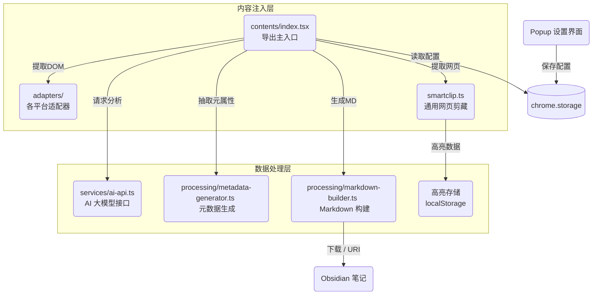

# Memflow - 记忆流动

从 AI 对话平台导出对话到 Obsidian 知识库的浏览器扩展。

[English](./README_EN.md) | [简体中文](./README.md)

## ✨ 功能特性

- ✅ **多平台聊天导出**：支持 DeepSeek、ChatGPT、Kimi、Gemini、豆包等 AI 对话平台
- ✅ **B站视频智能提炼**：支持导出获取 B 站视频原文字幕，并利用你配置的 AI API 一键生成结构化的视频摘要！
- ✅ **通用网页剪藏**：支持任意网页内容提取保存到笔记，智能提取标题、作者、描述、封面图等元数据
- ✅ **高亮标注**：选中网页文字即可标记高亮（黄/绿/蓝/粉色），支持添加笔记，点击高亮可删除或更改颜色
- ✅ **AI 增强摘要**：调用 AI 生成结构化摘要、关键词、智能分类
- ✅ **流式的重组构造**：自动生成带层级的 Markdown，包含标题、关键词、高光总结等
- ✅ **一键无缝接入**：自动通过 Obsidian Advanced URI 的方式保存至笔记系统或直接下载Markdown文件
- ✅ **极致沉浸**：页面右上角原生集成导出按钮

## 🚀 快速开始

### 开发环境

```bash
# 安装依赖
pnpm install

# 启动开发服务器
pnpm dev

# 构建生产版本
pnpm build
```

### 安装说明 (使用)

1. 前往本仓库的 **[Releases](https://github.com/your-repo/releases)** 页面
2. 下载最新版本（如 `v1.0.1`）的 `memflow-xxx.zip` 压缩包并解压到一个文件夹
3. 打开 Chrome 浏览器，访问 `chrome://extensions`
4. 打开右上角的 **"开发者模式"**
5. 点击左上角 **"加载已解压的扩展程序"**，选择你刚刚解压的文件夹即可！

### 在开发者模式中加载 (开发)

1. 安装依赖并执行 `pnpm build`（生产环境）或 `pnpm dev`（调试环境）
2. 按照上述步骤在 `chrome://extensions` 中加载 `build/chrome-mv3-prod` 或 `build/chrome-mv3-dev` 目录

### 使用方法

#### AI 对话平台
1. 访问支持的 AI 平台（DeepSeek、ChatGPT、Kimi、Gemini、豆包）
2. 进行对话
3. 点击页面右上角的导出按钮
4. Markdown 文件将自动下载或打开 Obsidian

#### B 站视频
1. 打开任意 B 站视频，确保已开启字幕
2. 点击扩展按钮，选择智能导出
3. 自动提取字幕并生成结构化摘要

#### 通用网页剪藏
1. 打开任意网页
2. **直接导出**：点击工具栏按钮
3. **智能导出**：右键点击按钮或 Shift+左键
4. **高亮标注**：选中文本后选择颜色标记，Ctrl+Shift+H 快速添加
5. **高亮操作**：点击已高亮区域可删除、更改颜色、添加笔记

#### 快捷键
- `Ctrl+Shift+E`：直接导出
- `Ctrl+Shift+G`：智能导出（AI 总结）

## 📁 项目结构

### 核心架构图



### 目录结构

```text
src/
├── contents/           # Content Scripts 注入脚本
│   ├── adapters/       # B站、ChatGPT、DeepSeek等平台适配器
│   │   ├── smartclip.ts    # 通用网页剪藏适配器
│   │   └── ...
│   └── index.tsx       # 页面主注入点（负责注入导出按钮和抓取流）
├── processing/         # 文本与逻辑处理层
│   ├── markdown-builder.ts   # 构建 Markdown 文本
│   ├── metadata-generator.ts # 本地算法与 AI 结合的元数据生成器
│   └── local-algorithms.ts   # 本地 NLP 摘要生成与分类
├── services/           # 服务与接口层
│   └── ai-api.ts       # 负责与外部大模型交互 (DeepSeek等) API
├── types/              # TypeScript 类型定义
├── config/             # 配置文件 (selectors.json DOM选择器)
├── popup.tsx           # 扩展设置弹窗界面
└── test/               # 自动化测试文件
```

## 🛠️ 技术栈

- **框架**: [Plasmo](https://www.plasmo.com/)
- **语言**: TypeScript
- **UI**: React
- **测试**: Vitest
- **构建**: pnpm

## 📋 开发路线图

- [x] Phase 0: 环境搭建
- [x] Phase 1: MVP - DeepSeek 基础导出
- [x] Phase 2: 多平台适配 (ChatGPT, Kimi, Gemini, 豆包)
- [x] Phase 3: UI 优化与多语言支持
- [x] Phase 4: SmartClip 通用网页剪藏 + 高亮标注
- [x] Phase 5: B站多 Part 视频支持
- [ ] Phase 6: 持续优化与完善

## 📚 开发文档

- [AGENTS.md](./AGENTS.md) - 开发指南和代码规范

## 🤝 参与贡献

欢迎提交 Issue 和 Pull Request！

## 📄 许可证

MIT License
