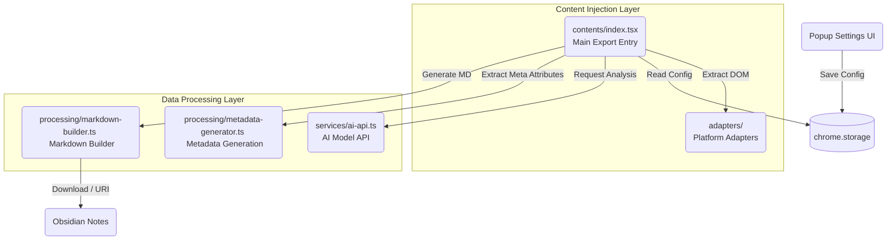

# Memflow - Memory Flow

A browser extension that exports chats from AI platforms to your Obsidian knowledge base.

[English](./README_EN.md) | [简体中文](./README.md)

## ✨ Features

- ✅ **Multi-platform Chat Export**: Supports DeepSeek, ChatGPT, Kimi, Gemini, Doubao, and other AI chat platforms.
- ✅ **Bilibili Video Intelligent Extraction**: Supports exporting and getting the original text subtitles of Bilibili videos, and using your configured AI API to generate a structured video summary with one click!
- ✅ **Streaming Reorganization and Construction**: Automatically generates Markdown with hierarchy, including titles, keywords, highlight summaries, etc.
- ✅ **One-click Seamless Integration**: Automatically saves to the note system via Obsidian Advanced URI or directly downloads Markdown files.
- ✅ **Ultimate Immersion**: Natively integrated export button in the top right corner of the page.

## 🚀 Quick Start

### Development Environment

```bash
# Install dependencies
pnpm install

# Start development server
pnpm dev

# Build production version
pnpm build
```

### Installation (Usage)

1. Go to the **[Releases](https://github.com/your-repo/releases)** page of this repository.
2. Download the latest version (e.g., `v1.0.1`) of the `memflow-xxx.zip` archive and extract it to a folder.
3. Open Chrome browser and go to `chrome://extensions`.
4. Turn on **"Developer mode"** in the top right corner.
5. Click **"Load unpacked"** in the top left corner, and select the folder you just extracted!

### Load in Developer Mode (Development)

1. Install dependencies and run `pnpm build` (production environment) or `pnpm dev` (debug environment).
2. Follow the steps above to load the `build/chrome-mv3-prod` or `build/chrome-mv3-dev` directory in `chrome://extensions`.

### How to Use

1. Visit a supported AI platform (DeepSeek, ChatGPT, Kimi, Gemini, Doubao).
2. Have a conversation.
3. Click the export button in the top right corner of the page (located to the left of the share button).
4. The Markdown file will be downloaded automatically or opened in Obsidian.

## 📁 Project Structure

### Core Architecture Diagram



### Directory Structure

```text
src/
├── contents/           # Content Scripts Injection
│   ├── adapters/       # Bilibili, ChatGPT, DeepSeek adapters, etc.
│   │   └── ...
│   └── index.tsx       # Main page injection point (responsible for injecting export button and capturing streams)
├── processing/         # Text and Logic Processing Layer
│   ├── markdown-builder.ts   # Builds Markdown text
│   ├── metadata-generator.ts # Metadata generator combining local algorithms and AI
│   └── local-algorithms.ts   # Local NLP summary generation and classification
├── services/           # Services and Interface Layer
│   └── ai-api.ts       # Responsible for interacting with external LLM APIs (DeepSeek, etc.)
├── types/              # TypeScript Type Definitions
├── config/             # Configuration Files (selectors.json DOM selectors)
├── popup.tsx           # Extension settings popup UI
└── test/               # Automated Test Files
```

## 🛠️ Technology Stack

- **Framework**: [Plasmo](https://www.plasmo.com/)
- **Language**: TypeScript
- **UI**: React
- **Testing**: Vitest
- **Build**: pnpm

## 📋 Development Roadmap

- [x] Phase 0: Environment Setup
- [x] Phase 1: MVP - DeepSeek Basic Export
- [x] Phase 2: Multi-platform Adaptation (ChatGPT, Kimi, Gemini, Doubao)
- [x] Phase 3: UI Optimization and Multi-language Support
- [ ] Phase 4: Claude Support and Bilibili in-depth long-form generation mechanism
- [ ] Phase 5: Polish and Release

## 📚 Development Documentation

- [AGENTS.md](./AGENTS.md) - Development guide and code conventions

## 🤝 Contributing

Issues and Pull Requests are welcome!

## 📄 License

MIT License
